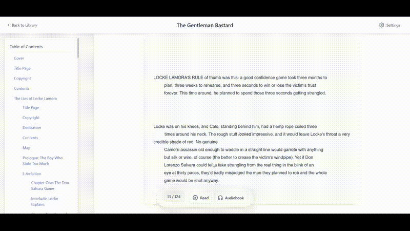
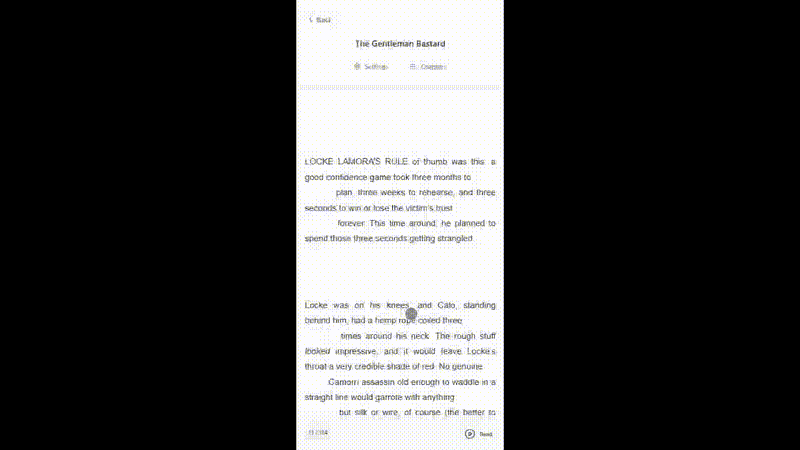

# YoRead — Turn your ebooks to audiobooks. Anywhere.

Discover a fast, delightful web reader that turns your EPUBs into an immersive, distraction‑free audiobook experience.

👉 Visit: https://www.yoread.com

---
### Demos & Media

## How it works (at a glance)

- Upload or open an EPUB in your browser
- YoRead parses, styles, and presents the book cleanly
- TTS generates audio in chunks while you read
- Your progress is saved automatically
- Continue on any device at https://www.yoread.com

#### Desktop view

#### Mobile

#### offline tts option (This only works on desktop Mac & Windows)

---

## What YoRead can do

- Text‑to‑Speech (TTS)
  - Natural, multi‑voice narration with pause/resume
  - Sentence‑level highlighting synced with speech
  - Prefetching for stutter‑free playback

- EPUB Reader
  - Clean typesetting and reader themes (Light, Dark, Sepia)
  - Adjustable font size and line height
  - Smart auto‑scroll and continuous reading

- Library & Navigation
  - Fast table of contents
  - Recently read books
  - Search and quick jump

- Mobile‑first UX
  - Optimized controls and gestures
  - Persistent progress across sessions

- Performance
  - Instant loads, chunked audio, image optimization
  - Designed for reliability, even on slow networks

---

## Coming soon

- Full cast audiobook with multiple ai voice support
- Notes, highlights, and export
- Multilingual TTS with auto‑language detection

---

## Privacy & Ownership

- Your reading progress is stored client‑side
- Your books remain yours
- TTS audio is generated on the fly and not retained

---

## FAQ

- Is it free?
  - Core reading and basic TTS are free while in active development.

- Which file types are supported?
  - EPUB today; more formats are planned.

- Does it work on mobile?
  - Yes — fully optimized for iOS and Android browsers.

- Do I need an app?
  - No install required. It’s a fast web app.

---

## Status

---

## Get started

- Read now: https://www.yoread.com  
- Feedback & requests: rajveer@yoread.com  

---

Made with care for readers who love great tools.
